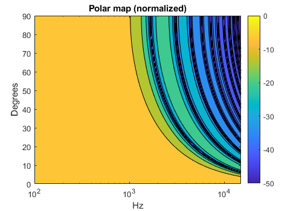
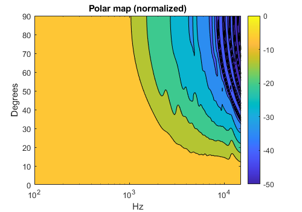
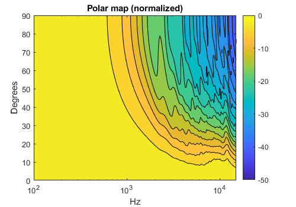
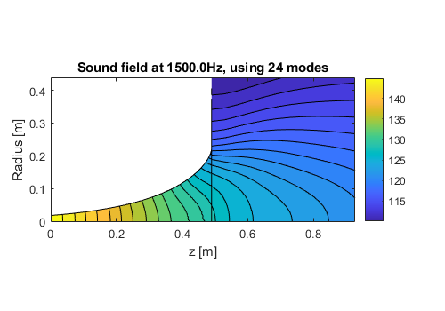

# MMM_toolbox

Repository for the Mode Matching Method (MMM) Toolbox by Bjørn Kolbrek.

Copyright (C) 2012-2025 by Bjørn Kolbrek

## Purpose

The MMM Toolbox simulates horns, either loudspeaker horns or musical instruments, using the Mode Matching Method (MMM) which describe the soundfield inside a duct by a sum of basis functions (modes). The method simulates both throat impedance, directivity and the sound field inside the horn. 

The code in this toolbox was written during my PhD and has since been somewhat modified to make it easier to use.

Currently only axisymmetric horns can be simulated, but code for rectangular horns is underway. 

A description of the theory of the method can be found in my thesis: https://ntnuopen.ntnu.no/ntnu-xmlui/handle/11250/2415853?show=full

## Getting Started

After downloading the code, the first thing you must do is to precalculate the radiation impedance. This is the starting point for all the simulations, and in order to speed up the calculations, the radiation impedance for a given horn is interpolated from precalculated data. It pays off to calculate a fairly large number of modes, especially if you want to compute directivity of large horns to high frequencies (high ka values, i.e. wavenumber (2 pi f / c) times radius). At least 30 modes, preferably something like 64 so you can check convergence. 

You do this by running PrecomputeAxiIBZ.m with the number of modes as argument. This will take some time. 

When the calculation is complete, the file zradfile.mat will contain the filename of the radiation impedance data file, which will be used in the calculations. You should now be able to run the examples.

## Limitations

The method is fast, but has a couple of limitations. First, the geometry is in many ways limited to shapes that have analytical mode functions, like circular and rectangular. While it is possible to find mode functions of other shapes numerically, this complicates the method significantly, and has not generally been used. Second, the code in this toolbox is limited to horns mounted in an infinite baffle (half space). Methods exist to simulate horns radiating into full space, but these have not been implemented in the toolbox yet. 

Another limitation is that the accuracy is limited by the number of modes. See below for how to check the accuracy. Fortunately the method does not completely give up and produce nonsense results, as can happen with BEM and FEM solutions with too coarse mesh, it is more a slow detoriation of the accuracy with frequency.

## How to set the number of segment and modes

The best way to this is by checking for convergence. 

If there are too few segments, the throat impedance will show wide variations at high frequencies, while for most horns the normalized impedance should flatten out towards unity. If the throat impedance flattens out and then suddenly go crazy, this is because numerical errors are introduced because the segments are too long. 

The required number of modes can be seen from the polar map. The combination of high freqencies and large angles is the most challenging, therefore the upper right hand corner of the polar map will converge the slowest. Before convergence there will be null lines comparable to that of a rigid piston/plane wave. Here is how it looks with the horn in AxiHornDemo1.

As the number of modes is increased, the piston pattern will be pushed towards the upper right hand corner and eventually disappear when the number of modes is sufficient for the horn geometry and frequency range. There may still be some changes, so check for convergence to be safe.

Below are polar maps for 6 and 20 modes.

Looking at the soundfield inside the horn is another option. By adjusting the number of modes, one can examine where and how the sound field changes, as it approaches convergence. If too few modes are specified, the plot will not represent the actual sound field inside the horn. As the number of modes is increased, the field converges, and the equi-pressure contours become less wiggly. A wiggly equi-pressure contour does not necessarily imply low accuracy in the far field pressure.

Below are sound fields from AxiHornDemo2 for 6 and 24 modes

## License

The MPM Toolbox is free software: you can redistribute it and/or modify it under the terms of the GNU General Public License as published by the Free Software Foundation, either version 2 of the License, or (at your option) any later version.

The MMM Toolbox is distributed in the hope that it will be useful, but WITHOUT ANY WARRANTY; without even the implied warranty of MERCHANTABILITY or FITNESS FOR A PARTICULAR PURPOSE. See the GNU General Public License for more details.

You should have received a copy of the GNU General Public License along with the MMM Toolbox. If not, see <http://www.gnu.org/licenses/>.
